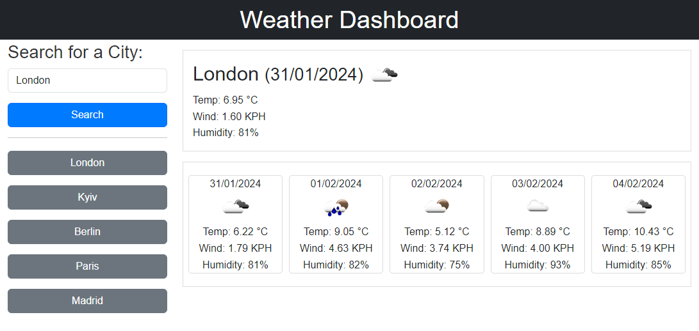

# Weather Dashboard

## Overview

The Weather Dashboard is a web application that allows users to see the weather forecast for multiple cities. It features dynamically updated HTML and CSS, utilizing the OpenWeatherMap API to retrieve weather data based on geographical coordinates.

## Preview



## Link to the Deployed Application

[https://volodymyr-shtyka.github.io/Skyline-Forecast/](https://volodymyr-shtyka.github.io/Skyline-Forecast/)

## User Story

As a traveler, I want to see the weather outlook for multiple cities so that I can plan my trip accordingly.

## Acceptance Criteria

- Create a weather dashboard with form inputs.
- When a user searches for a city, they should be presented with current and future conditions for that city, and the city should be added to the search history.
- When viewing the current weather conditions for a city, users should see:
    - The city name
    - The date
    - An icon representing weather conditions
    - The temperature
    - The humidity
    - The wind speed
- Viewing future weather conditions for a city should display a 5-day forecast with details including:
    - The date
    - An icon representing weather conditions
    - The temperature
    - The humidity
- Clicking on a city in the search history should present users with both current and future conditions for that city.

## How to Use

1. **Clone the Repository:**
    - Clone the repository to your local machine using the following command:
      ```bash
      git clone git@github.com:Volodymyr-Shtyka/Skyline-Forecast.git
      ```

2. **Navigate to the Project Directory:**
    - Change into the project directory:
      ```bash
      cd Skyline-Forecast
      ```

3. **Open the Index.html File:**
    - Open the `index.html` file in a web browser to access the Weather Dashboard.

4. **Using the Dashboard:**
    - Enter the name of the city you want to check the weather for in the search input.
    - Click the "Search" button to get the current weather and a 5-day forecast.
    - The application will display the weather information for the searched city, and the history of searched cities will be visible on the left.

## Code Structure

- **index.html:** Main HTML file providing the structure of the Weather Dashboard.
- **style.css:** CSS file styling the appearance of the application.
- **script.js:** JavaScript file containing the logic for fetching weather data, updating the UI, and handling user interactions.

## Third-Party Libraries

- **Bootstrap:** Used for styling and layout.
- **jQuery:** Used for DOM manipulation and handling events.
- **Day.js:** Library for working with dates and times in the browser.

## Notes

- The application uses the OpenWeatherMap API to retrieve weather data.
- The geographical coordinates of a city are obtained using the 5 Day Weather Forecast API.
- The application stores search history in localStorage for a personalized experience.
- Explore, modify, and enhance the code to meet your preferences while ensuring the core functionality remains intact. Refer to code comments or documentation for assistance.

## Author

Volodymyr Shtyka

## License

This project is licensed under the MIT License - see the [LICENSE](LICENSE) file for details.